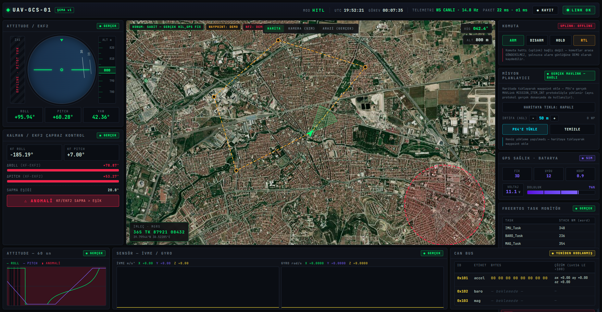

# UAV Ground Control Station
### Multi-Layer Telemetry System — STM32 + FreeRTOS + CAN Bus + MAVLink + PX4 HITL + ROS2 + Web GCS


> A hardware-in-the-loop UAV telemetry system where a physical STM32 flight-sensor node drives a real PX4 flight-control stack: tilting the actual board in your hand moves a simulated drone in Gazebo, streams a live EKF2/Kalman-verified attitude estimate over ROS2, and renders on a defense-industry-style web Ground Control Station — complete with a real-terrain 3D POV camera and a real MAVLink mission planner.

---

## Overview

This project implements a complete, end-to-end UAV telemetry stack, from bare-metal firmware to a browser-based GCS, using the exact protocols (MAVLink, CAN Bus, FreeRTOS, uXRCE-DDS) that production defense/UAV systems use:

```
STM32F103 (FreeRTOS)               real GY-87 IMU/baro/mag data
    │  CAN Bus 500 kbps (loopback)  +  MAVLink HIL_SENSOR over UART
    ▼
hil_bridge.py                       forwards real sensor frames into PX4's HITL link
    │  TCP (HITL lockstep)
    ▼
PX4 (HITL)                          EKF2 sensor fusion, mission/waypoint manager
    │  uXRCE-DDS
    ▼
ROS2 Jazzy                          Kalman cross-check + anomaly alarm, GCS bridge
    │  WebSocket (~15 Hz)
    ▼
Web GCS Dashboard                   live map, 3D terrain POV, camera+OSD, mission upload
```

**Key highlight:** the STM32 board feeds real GY-87 sensor data (accelerometer, gyroscope, magnetometer, barometer) into PX4 via MAVLink HITL — physically tilting the STM32 visibly moves the simulated airframe in Gazebo and drives a real EKF2 attitude estimate, in real time.

---

## Live Dashboard



*Tactical map, real-terrain 3D POV camera (CesiumJS), MAVLink mission planner, live attitude HUD, CAN bus panel, and FreeRTOS task monitor — all driven by the physical STM32 board pictured above.*

---

## System Architecture

```
┌─────────────────────────────────────────────────────┐
│              STM32F103 — Hardware Layer              │
│                                                       │
│  [IMU Task]    [Baro Task]   [Mag Task]              │
│  MPU6050       BMP180        QMC5883P                │
│  500ms / I2C   2000ms / I2C  1000ms / I2C            │
│       │              │            │                  │
│       └──────────────┴────────────┘                  │
│                      │ Queue + Mutex                 │
│              [CAN TX Task]      [WDG Task]           │
│         CAN Bus 500kbps          task health          │
│         ID: 0x101–0x10F          (stack HWM, heap)    │
└──────────────────────┬────────────────────────────────┘
                       │ MAVLink HIL_SENSOR / UART (USB-TTL)
┌──────────────────────▼────────────────────────────────┐
│         hil_bridge.py — HITL relay (50 Hz)             │
└──────────────────────┬────────────────────────────────┘
                       │ TCP (HITL lockstep)
┌──────────────────────▼────────────────────────────────┐
│              PX4 — Flight Control Layer                │
│                                                        │
│   EKF2 Sensor Fusion   →   Mission / Waypoint Manager  │
│   (real IMU + baro + mag)   (MAVLink mission protocol) │
└──────────────────────┬────────────────────────────────┘
           │ uXRCE-DDS              │ MAVLink (GCS link, 18570)
┌──────────▼───────────┐  ┌─────────▼──────────────────┐
│   ROS2 Jazzy          │  │  Gazebo (pose puppet +      │
│  Kalman fusion +      │  │  gimbal camera → MJPEG)     │
│  anomaly alarm        │  │                             │
└──────────┬────────────┘  └─────────┬───────────────────┘
           │ WebSocket / REST (server.py, FastAPI)        │
┌──────────▼──────────────────────────────────────────────▼──┐
│                 Web GCS Dashboard (browser)                 │
│                                                              │
│  Tactical map   │  Real-terrain    │  Camera + OSD   │ CAN  │
│  + MGRS grid    │  3D POV/chase    │  overlay        │ hex  │
│  + mission      │  camera (Cesium) │  (MJPEG stream) │ panel│
│  planner (click │                  │                 │      │
│  → upload)      │                  │                 │      │
│                 Attitude HUD  │  FreeRTOS monitor │  Alarms  │
└───────────────────────────────────────────────────────────┘
```

---

## Hardware

| Component | Part | Interface | Purpose |
|-----------|------|-----------|---------|
| MCU | STM32F103C8T6 (Blue Pill) | — | Main controller |
| IMU | GY-87 (MPU6050 + QMC5883P* + BMP180) | I2C | 10-DOF sensor fusion |
| CAN Transceiver | SN65HVD230 | CAN | Physical CAN layer |
| USB-UART | Generic USB-to-TTL adapter (PL2303 chip) | UART | MAVLink to PC |
| Termination | 120Ω resistor × 2 | CAN bus ends | Signal integrity |

*GY-87 boards are commonly sold with an "HMC5883L" silkscreen, but the actual magnetometer die
found on this unit (via I2C bus scan, addr `0x2C` instead of `0x1E`) is a QMC5883P clone with a
completely different register map — the driver targets the real chip, not the label.

---

## FreeRTOS Task Architecture

| Task | Priority | Period | Function |
|------|----------|--------|----------|
| `IMU_TASK` | High | 500ms | MPU6050 accel + gyro via I2C → Queue |
| `MAG_TASK` | Medium | 1000ms | QMC5883P magnetometer → Queue |
| `BARO_TASK` | Medium | 2000ms | BMP180 pressure + temp → Queue |
| `CAN_TX_TASK` | Medium | triggered | Dequeue → pack → transmit (Mutex protected) |
| `WDG_TASK` | Low | 1000ms | System health, heap monitor, task stack high-water marks, heartbeat |

Every task's stack high-water mark and free heap are streamed live off the board (`NAMED_VALUE_INT` over MAVLink) and rendered in the dashboard's FreeRTOS panel — this is real RTOS telemetry, not a simulated readout.

---

## CAN Bus Message Format

| CAN ID | DLC | Payload | Description |
|--------|-----|---------|--------------|
| 0x101 | 8B | `[ax16][ay16][az16][gx8][gy8][gz8]` | IMU accel + gyro |
| 0x102 | 4B | `[gx16][gy16][gz16][pad]` | Gyro high-res |
| 0x103 | 4B | `[pressure32]` | Barometer |
| 0x104 | 4B | `[temp_raw16][alt16]` | Temperature + altitude |
| 0x105 | 6B | `[mx16][my16][mz16]` | Magnetometer |

---

## Web GCS Dashboard

A framework-free, single-page dashboard (`tools/gcs_web/`) styled after real defense-industry ground stations — dark theme, MGRS grid, on-screen-display (OSD) overlay, no build step, no CDN dependency for its JS/CSS.

- **Tactical map** — Leaflet + Esri World Imagery, MGRS grid overlay, drone icon that rotates with real yaw, sensor FOV cone.
- **Mission planner** — click the map to place waypoints, upload them to PX4 with the real MAVLink mission protocol (`MISSION_COUNT` → `MISSION_ITEM_INT` → `MISSION_ACK`) — the exact same protocol a real GCS uses against real hardware.
- **Real-terrain 3D POV / chase camera** — CesiumJS with real global terrain + satellite imagery (Cesium ion `Terrain.fromWorldTerrain()`), camera driven by the drone's real lat/lon/alt and real roll/pitch/yaw.
- **Camera + OSD overlay** — live MJPEG stream from Gazebo's gimbal camera with a HUD overlay (pitch ladder, heading tape, MGRS, LINK status) sharing the exact same telemetry state as every other panel.
- **Attitude HUD** — canvas artificial horizon + numeric roll/pitch/yaw readout, driven by PX4's EKF2 output.
- **Kalman cross-check** — an independent 2-state Kalman filter runs against the same raw IMU data and flags sustained disagreement with EKF2 as an anomaly.
- **CAN bus hex panel** — live accelerometer data re-encoded into the firmware's documented 0x101 CAN frame format.
- **FreeRTOS task monitor** — real stack high-water marks and heap, streamed off the board.

### Real vs. synthetic data

This is an interview portfolio project, so every panel is honestly labeled — nothing fake is presented as real:

| Panel | Status | Note |
|---|---|---|
| Attitude HUD | **REAL** | `/fmu/out/vehicle_attitude`, PX4 EKF2, real STM32 IMU |
| Kalman/EKF2 cross-check + anomaly alarm | **REAL** | independent Kalman filter on raw gyro/accel vs. EKF2 |
| Accel/gyro sparklines | **REAL** | `/fmu/out/sensor_combined` |
| Map center / position | **REAL but STATIC** | `hil_bridge.py` sends a fixed HIL GPS origin; the drone icon rotates with real yaw but doesn't translate |
| Mission planner (cyan waypoints) | **REAL** | genuine MAVLink `MISSION_ITEM_INT` upload + PX4 `MISSION_ACK` |
| Real-terrain 3D POV/chase camera | **REAL** | real Cesium ion terrain + real position/attitude |
| Camera feed + OSD roll/pitch/yaw/MGRS/LINK | **REAL** | Gazebo gimbal camera via MJPEG; OSD reads the same live telemetry |
| FreeRTOS task monitor | **REAL** | `uxTaskGetStackHighWaterMark()` streamed off the board over MAVLink |
| CAN 0x101 (accel) | **REAL data, re-encoded** | CAN is physically loopback-only (never reaches the PC); the panel re-encodes the same live accel data into the documented CAN frame format |
| CAN 0x102/0x103 (baro/mag) | **PENDING** | firmware has these as a documented TODO stub; the panel reflects that honestly instead of inventing values |
| Battery | **FULLY SYNTHETIC**, "SIM" badge | STM32 has no ADC/VBAT wiring |
| OSD gimbal PIT/YAW, ZOOM, speed | **"—" / not produced** | no real gimbal or velocity telemetry channel exists; deliberately left null rather than showing placeholder numbers |
| MGRS grid, sensor FOV cone | **Real math over real position** | genuine geodesy/trigonometry, drawn as a capability demo |
| Demo waypoint route (orange), NFZ circle | **Labeled "DEMO"** | a deliberate static capability showcase, not tied to a live mission |

Out of scope for this project (would need real hardware not present on this board, noted honestly rather than faked): offline MBTiles/GeoTIFF map caching, DEM-based collision avoidance, KML/Shapefile import UI, STANAG 4586, a real battery ADC circuit, and a real CAN-to-PC bridge (CAN is currently loopback-only; a USB-CAN adapter would be needed to bring it off-board).

---

## Project Status

| Layer | Status | Notes |
|-------|--------|-------|
| STM32 FreeRTOS tasks | ✅ Complete | IMU/baro/mag/CAN TX/watchdog tasks |
| GY-87 I2C driver | ✅ Complete | MPU6050 + BMP180 + QMC5883P all done |
| CAN Bus transmission | ✅ Complete (loopback mode) | SN65HVD230 transceiver |
| MAVLink encoding | ✅ Verified on hardware | official `mavlink/c_library_v2`, HEARTBEAT + HIL_SENSOR + NAMED_VALUE_INT |
| PX4 SITL first flight | ✅ Complete | Gazebo (`gz_x500`), arm → takeoff → land verified via commander log |
| PX4 HITL bridge | ✅ Complete | `tools/hil_bridge.py` forwards real STM32 sensors into PX4's HITL link at 50Hz; EKF2 runs clean on real hardware data |
| Gazebo visualization | ✅ Complete | `tools/attitude_to_gazebo.py` teleports a model's pose from PX4's live attitude estimate; physically tilting the board visibly moves it in Gazebo |
| ROS2 uXRCE-DDS bridge | ✅ Complete | Micro-XRCE-DDS-Agent + `px4_msgs`/`px4_ros_com`; `attitude_listener` streams real hardware data end-to-end into ROS2 |
| ROS2 Kalman fusion + anomaly alarm | ✅ Complete | independent Kalman filter cross-checks PX4's EKF2, flags sustained disagreement |
| FreeRTOS task telemetry | ✅ Complete | real stack high-water marks + heap streamed off the board |
| Live camera feed + OSD overlay | ✅ Complete | Gazebo gimbal camera → MJPEG → browser, defense-style HUD overlay |
| Real-terrain 3D POV/chase camera | ✅ Complete | CesiumJS, real global terrain + satellite imagery |
| MAVLink mission planner | ✅ Complete | real `MISSION_ITEM_INT` upload/clear against PX4, `MISSION_ACK`-verified |
| Web GCS dashboard | ✅ Complete | full defense-industry-style UI, see [Web GCS Dashboard](#web-gcs-dashboard) |

---

## Software Dependencies

```bash
# ROS2
sudo apt install ros-jazzy-desktop

# PX4 (HITL)
git clone https://github.com/PX4/PX4-Autopilot.git
cd PX4-Autopilot && make px4_sitl_default

# uXRCE-DDS agent (built from source, see below)
git clone https://github.com/eProsima/Micro-XRCE-DDS-Agent.git
cd Micro-XRCE-DDS-Agent && mkdir build && cd build
cmake .. -DCMAKE_BUILD_TYPE=Release && make -j$(nproc)

# ROS2 bridge packages
git clone --branch release/1.16 https://github.com/PX4/px4_msgs.git ros2_ws/src/px4_msgs
git clone https://github.com/PX4/px4_ros_com.git ros2_ws/src/px4_ros_com
ln -s $(pwd)/ros2/uav_gcs_bridge ros2_ws/src/uav_gcs_bridge   # this repo's own node
cd ros2_ws && colcon build --symlink-install

# Web GCS dashboard (own venv, inherits rclpy from the system ROS2 install)
cd tools/gcs_web
python3 -m venv --system-site-packages .venv
.venv/bin/pip install fastapi "uvicorn[standard]" websockets
cp .env.example .env   # then fill in your own Cesium ion token

# STM32 firmware
# STM32CubeIDE + STM32CubeMX
```

### Running the full stack

Start each piece in order — PX4's mavlink module doesn't exist until it receives its first `HIL_SENSOR`, so hil_bridge must come up before anything tries to talk to PX4's GCS link:

```bash
# 1. STM32 firmware flashed, board + USB-UART adapter connected

# 2. PX4 (HITL)
cd ~/PX4-Autopilot && make px4_sitl_default none_iris

# 3. HITL bridge (real STM32 sensors → PX4)
sg dialout -c "python tools/hil_bridge.py"

# 4. uXRCE-DDS agent
./Micro-XRCE-DDS-Agent/build/MicroXRCEAgent udp4 -p 8888

# 5. Gazebo pose puppet + gimbal camera (optional, for the camera/POV panels)
gz sim -s -r tools/gz_puppet/puppet_world.sdf
ros2 run ros_gz_image image_bridge /world/stm32_puppet_world/model/stm32_puppet/link/camera_link/sensor/camera/image
python tools/attitude_to_gazebo.py --gcs-port 14580

# 6. Web GCS dashboard
source /opt/ros/jazzy/setup.bash && source ~/stm32_ws/ros2_ws/install/setup.bash
tools/gcs_web/.venv/bin/python tools/gcs_web/server.py
# → http://127.0.0.1:8765/
```

---

## Roadmap

- [x] System architecture design
- [x] Hardware selection and procurement
- [x] STM32 FreeRTOS task skeleton
- [x] MPU6050 I2C driver (real accel + gyro data)
- [x] BMP180 I2C driver (real pressure + temp + altitude)
- [x] QMC5883P I2C driver (real magnetometer data)
- [x] Gyro bias + magnetometer hard-iron calibration (verified on hardware)
- [x] CAN Bus frame encoding and transmission
- [x] MAVLink bridge (STM32 → PC) — HEARTBEAT + HIL_SENSOR verified on hardware
- [x] PX4 SITL setup and first simulated flight (Gazebo `gz_x500`, arm → takeoff → land)
- [x] Hardware-in-the-loop: real IMU → PX4 — EKF2 runs clean on real sensor data, live attitude estimate verified
- [x] Gazebo visualization: PX4 attitude → live model pose — physical tilt verified moving the model in real time
- [x] ROS2 uXRCE-DDS bridge: Micro-XRCE-DDS-Agent + `px4_msgs`/`px4_ros_com`, custom `attitude_listener` node verified against real hardware data
- [x] ROS2 Kalman fusion node: independent gyro/accel Kalman filter cross-checked against PX4's EKF2, anomaly alarm on sustained disagreement
- [x] Real FreeRTOS task-health telemetry (stack high-water marks + heap, streamed off the board)
- [x] Web GCS dashboard (tactical map, attitude HUD, CAN panel, FreeRTOS monitor, alarms)
- [x] Live camera feed + defense-style OSD overlay (Gazebo gimbal camera → MJPEG)
- [x] Real-terrain 3D POV / chase camera (CesiumJS, real global terrain + satellite imagery)
- [x] MAVLink mission planner (real `MISSION_ITEM_INT` upload/clear, `MISSION_ACK`-verified)
- [ ] Demo video: physical STM32 movement → Gazebo drone response → live dashboard (recording)

**Deliberately out of scope** (would need hardware this board doesn't have, or a multi-week infrastructure effort not proportionate to a portfolio project): offline MBTiles/GeoTIFF map caching, DEM-based collision avoidance, KML/Shapefile import UI, STANAG 4586, a real battery ADC circuit, a real CAN-to-PC bridge, GitHub Actions CI (no CI runner has access to the physical STM32/GY-87 hardware this project depends on end-to-end).

---

## Motivation

Modern defence UAV systems rely on exactly this architecture: a dedicated embedded sensor node communicating over CAN Bus, a flight controller running on ARM Cortex-M hardware with a real-time OS, and a ground control station processing telemetry in real time. This project implements that full stack from bare-metal firmware to a web-based GCS, using the same protocols (MAVLink, CAN Bus, FreeRTOS, uXRCE-DDS) used in production systems — and is honest, panel by panel, about exactly which data is real hardware output and which is a labeled placeholder.

---

## Author

**Yusuf Tuzcu** — Electrical & Electronics Engineering, Eskisehir Osmangazi University

IHA-1 UAV Pilot License | github.com/ysftzc

---

*Complete end-to-end system: real STM32 hardware driving a real PX4 flight stack, rendered on a real web GCS.*
